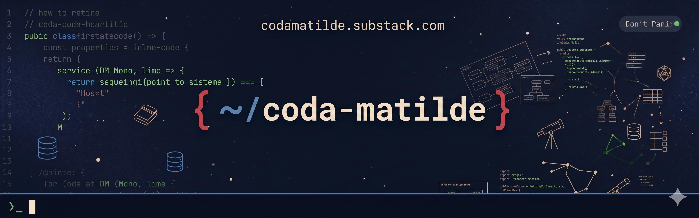

> *"Da QA que testa à QA que entende o sistema."*

Sabe quando a automação passa (ou quebra) e você não tem ideia do que rolou no banco de dados? Ou quando esbarra num bug complexo, mas a arquitetura do sistema parece um idioma alienígena na hora da daily?

Se você já sentiu que a área foca muito em ferramentas e pouco na engenharia de software (como o motor da aplicação funciona de verdade), você chegou ao lugar certo. 

> Não entre em pânico.

## 👾 Nosso objetivo

O **Coda Matilde** é o nosso manual de exploração. Somos engenheiras que decidiram parar de olhar para a interface como uma caixa-preta e abrir o código para entender as engrenagens.

Nosso objetivo é simples: te dar base técnica para dominar o sistema que você testa e mudar como o nosso trabalho é visto. O mercado, muitas vezes, ainda acha que QAs são "descartáveis" ou que nosso trabalho pode ser absorvido por POs, devs ou qualquer um que saiba "clicar em botões" e seguir os cenários de testes escritos. Nós queremos quebrar esse estigma. Entender de banco de dados, infraestrutura ou como uma API é construída não significa que você queira virar dev. Significa que, sabendo como o terreno foi desenhado, você sabe exatamente onde ele é frágil.

Mais do que testar o que já está pronto, queremos mostrar como a visão de qualidade pode (e deve!) ser aplicada na construção e definição da arquitetura de software. Queremos te preparar para influenciar decisões técnicas desde o zero. Traduzindo conceitos complexos direto para a nossa rotina, você poderá debater requisitos de igual para igual, antecipar riscos reais e prever falhas estruturais antes mesmo da primeira linha de código ser escrita. É assim que uma QA se torna indispensável para o time.

## 👩🏽‍💻 O que vamos construir aqui?

O universo do software é vasto. Para guiar a nossa jornada, nossos projetos vão seguir numa mistura de RPG, astronomia e Guia dos Mochileiros da Galáxia.

A ideia é criarmos desafios, projetos práticos e conteúdos técnicos focados no nosso dia a dia. A regra principal por aqui é: não vamos apenas jogar código na sua tela. Para cada tecnologia nova, vamos te explicar o porquê aprender aquilo faz sentido para uma QA. Vamos mostrar exatamente como esse conhecimento pode agregar à sua rotina, deixar seus testes mais precisos e dar mais voz nas reuniões de refinamento.

Teremos repositórios para você clonar, explorar, subir de nível e quebrar coisas localmente no seu computador sem medo. Construiremos aplicações do zero que ganham camadas aos poucos, para você entender como testar cada fase da evolução do software.

> O universo é gigante, e você nunca foi "só" uma testadora. Pegue sua toalha, abra sua IDE, comece a explorar e lembre-se de que a resposta sempre foi 42.

---

🔗 Acompanhe por aqui: codamatilde.substack.com
